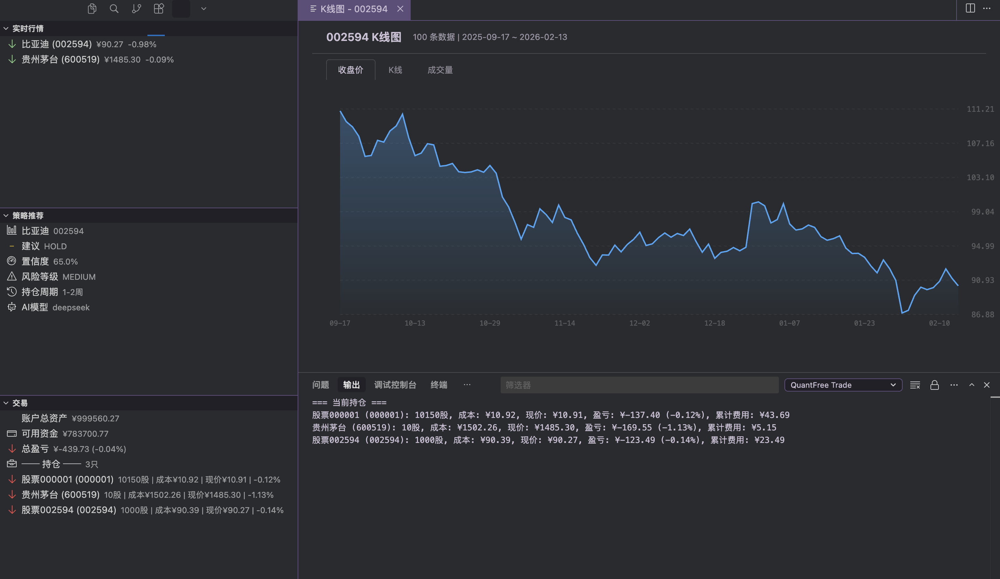
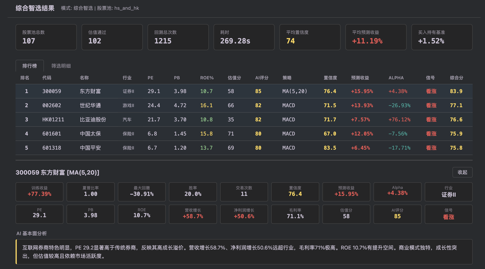

<div align="center">


# QuantFree - VSCode股票交易助手

[](https://opensource.org/licenses/MIT)
[](https://www.typescriptlang.org/)
[](https://www.python.org/)
[](https://fastapi.tiangolo.com/)
[](https://github.com/ZhengWG)

**一款集成在VSCode/Cursor编辑器中的A股交易管理插件**
**实时行情 · AI策略推荐 · 模拟交易 · K线可视化 · 策略回测 · 智能选股 · 策略测试 · 预测分析**

</div>

---

**作者**：[Zheng Wengang](https://github.com/ZhengWG) | **个人网站**：[johneyzheng.top](https://johneyzheng.top/)

## 功能预览

<div align="center">



*左侧：实时行情 / AI策略推荐 / 持仓管理 — 右侧：K线可视化图表（收盘价折线图、K线图、成交量图）— 下方：交易记录输出*

</div>

## 核心功能

### 实时行情监控
- 在VSCode侧边栏实时查看A股行情，涨跌一目了然（红涨绿跌图标）
- 支持沪深A股（如 000001 平安银行、600519 贵州茅台、002594 比亚迪）
- 实时价格、涨跌幅、成交量自动刷新（可配置刷新间隔）

### K线可视化
- 基于 WebView + Canvas 的**交互式K线图表**
- 三种视图一键切换：**收盘价折线图** / **K线图（蜡烛图）** / **成交量柱状图**
- 鼠标悬停显示详细数据（日期、开高低收、涨跌额、成交量）
- 渐变填充 + 涨跌配色，视觉体验优秀
- 支持日K / 周K / 月K（腾讯财经API）

### AI策略推荐
- 集成 **DeepSeek / OpenAI** 大模型，基于实时行情生成个性化策略
- 提供买入 / 卖出 / 持有建议、目标价位、止损位
- 风险评估与置信度评分，结果直接展示在侧边栏
- 策略理由详细输出到 OutputChannel

### 模拟交易
- 市价单自动获取实时价格成交，限价单指定价格成交
- 滑点模拟（0.1% +/- 随机浮动）
- A股真实手续费：佣金0.025%（最低5元）、印花税0.05%（仅卖出）、过户费0.001%
- **侧边栏持仓面板**：实时显示账户总资产、可用资金、总盈亏、各股票持仓详情
- 下单后自动刷新持仓视图
- 初始模拟资金100万元

### 策略回测
- 基于真实历史K线数据测试策略
- 支持**多策略**：均线交叉（MA Cross）、MACD、KDJ、RSI、布林带等，可配置短/长周期
- 可配置风控参数：止损比例、移动止盈、单笔风险、最大仓位、趋势均线、冷却天数
- 计算收益率、夏普比率、最大回撤、胜率、交易次数等指标，返回每笔交易明细
- 支持**港股**（代码如 HK00700）

### 智能选股回测
- **经典模式**：技术面筛选（趋势向上/动量/放量突破/RSI超卖/MACD金叉等）+ 多策略回测 + 综合评分排序
- **综合智选**：估值筛选（池内 PE/PB/ROE/盈利增长 百分位评分）→ AI 基本面分析（DeepSeek，行业相对）→ 策略测试（80/20 Walk-Forward）→ 预测收益 → 复合排名 TopK
- 股票池：沪深热门、行业龙头、港股热门、A+港股、自定义代码
- 结果展示：排行表（行业、PE/PB/ROE、估值分、AI 评分、置信度、预测收益、Alpha、信号）、详情面板（股价走势、买卖标记、收益预测曲线、交易明细）

<div align="center">



*综合智选结果：排行榜（行业/PE/PB/ROE/估值分/AI评分/策略/置信度/预测收益/Alpha/信号）、概览指标与个股详情（含 AI 基本面分析）*

</div>

### 策略测试（Walk-Forward 验证）
- 选定日期区间，前 80% 作为训练期、后 20% 作为测试期
- 对多策略分别回测，比较预测收益与实际收益，计算**置信度**（方向准确、收益误差、Alpha 等维度）
- 支持查看训练/测试权益曲线、买入持有基准、策略对比表

### 预测分析
- 多因子评分（估值、趋势、动量、波动、成交量）+ 线性拟合 R²
- 基于历史收益与因子预测未来 N 月收益，给出乐观/悲观区间
- 结果含历史与预测权益曲线、月度收益统计

## 快速开始

### 环境要求
- VSCode 1.70+ 或 Cursor
- Python 3.8+（后端服务）
- Node.js 18+（VSCode插件前端）

### 安装步骤

```bash
# 1. 克隆项目
git clone https://github.com/ZhengWG/quant_free.git
cd quant_free

# 2. 安装后端依赖
cd server
pip install -r requirements.txt

# 3. 配置环境变量（可选，行情数据无需配置）
cp .env.example .env
# 编辑 .env，填入 DEEPSEEK_API_KEY（用于AI策略生成）

# 4. 启动后端服务
python main.py
# 服务启动在 http://localhost:3000
# API文档：http://localhost:3000/docs

# 5. 安装前端依赖并编译
cd ../extension
npm install
npm run compile
```

### 运行VSCode插件

在VSCode/Cursor中打开项目根目录，按 `F5` 启动Extension Development Host。

## VSCode插件使用指南

插件启动后，左侧活动栏出现 **QuantFree** 图标，点击展开三个面板：**实时行情** / **策略推荐** / **交易**。

所有功能也可通过**命令面板**（`Ctrl+Shift+P` / `Cmd+Shift+P`）调用：

### 1. 添加自选股

命令面板输入：`QuantFree: 添加自选股`

```
输入股票代码 → 000001
→ 提示 "已添加自选股: 000001"
→ 侧边栏 "实时行情" 面板出现：
  ↓ 平安银行 (000001)  ¥10.91  -0.46%
```

支持的代码格式：
- A股：`000001`（平安银行）、`600519`（贵州茅台）、`002594`（比亚迪）
- 6开头自动识别为上交所，其他为深交所

### 2. 删除自选股

命令面板输入：`QuantFree: 删除自选股`

```
→ 弹出已添加的股票列表
→ 选择要删除的代码
→ "已删除 000001"
```

### 3. 查看K线图

命令面板输入：`QuantFree: 打开K线图`

```
输入股票代码 → 002594
→ 新标签页打开可视化K线图表
→ 支持三种视图切换：收盘价 / K线 / 成交量
→ 鼠标悬停查看每日详情
```

### 4. AI策略推荐

命令面板输入：`QuantFree: 生成策略推荐`

```
输入股票代码 → 002594
→ 侧边栏 "策略推荐" 面板显示：
  比亚迪  002594
  建议  HOLD
  置信度  65.0%
  风险等级  MEDIUM
  持仓周期  1-2周
  AI模型  deepseek
→ OutputChannel 显示完整策略理由
```

> 需要在 `server/.env` 中配置 `DEEPSEEK_API_KEY` 才能获得真实AI分析

### 5. 下单交易

命令面板输入：`QuantFree: 下单`

```
步骤1: 输入股票代码 → 000001
步骤2: 选择操作类型 → 买入 / 卖出
步骤3: 选择价格类型 → 市价单 / 限价单
步骤4: (限价单) 输入价格 → 10.90
步骤5: 输入数量 → 100
步骤6: 确认弹窗 → "确认买入 000001 100股 @ ¥10.90？"

→ 输出面板显示成交结果：

订单成交！
订单号：a85e728f-...
状态：FILLED
成交价：¥10.91 (滑点 0.092%)
─── 费用明细 ───
  佣金：¥5.00
  印花税：¥0.00
  过户费：¥0.01
  总费用：¥5.01

→ 侧边栏 "交易" 面板自动刷新持仓
```

### 6. 查看持仓

命令面板输入：`QuantFree: 查看持仓`

```
→ 侧边栏 "交易" 面板显示：
  💰 账户总资产  ¥999,560.27
  💳 可用资金    ¥783,700.77
  📊 总盈亏      -¥439.73 (-0.04%)
  ── 持仓 ── 3只
  ↓ 平安银行 (000001)  10150股 | 成本¥10.92 | 现价¥10.91 | -0.12%
  ↓ 贵州茅台 (600519)  10股 | 成本¥1502.26 | 现价¥1485.30 | -1.13%
  ↓ 比亚迪 (002594)    1000股 | 成本¥90.39 | 现价¥90.27 | -0.14%
```

### 7. 智能选股回测

命令面板输入：`QuantFree: 智能选股回测`

```
步骤1: 选择模式 → 经典模式 / 综合智选
步骤2: 选择股票池 → 沪深热门 / 行业龙头 / 港股热门 / A股+港股 / 自定义
步骤3: (经典) 选择选股策略 或 (综合智选) 选择预测月数(3/6/12月)
步骤4: 输入回测开始/结束日期
步骤5: (经典) 可选自定义风控参数

→ 新标签页展示：排行表、筛选明细；点击某行可展开详情（股价走势、收益预测曲线、交易明细）
```

- **经典模式**：先按技术面筛选，再对通过股票做多策略回测，按综合评分排序。
- **综合智选**：先按池内百分位估值筛选，再经 AI 基本面分析（需配置 DEEPSEEK_API_KEY）、策略测试与预测收益，按复合分排序；表格含行业、PE/PB/ROE、估值分、AI 评分、置信度、预测收益等。

### 8. 策略测试

命令面板输入：`QuantFree: 策略测试`

```
输入股票代码 → 600519
输入开始日期 → 2021-01-01
输入结束日期 → 2025-12-31
→ 新标签页展示：训练/测试区间、各策略置信度与收益对比、权益曲线与买入持有基准
```

用于验证策略在“未见过”的测试期表现，置信度综合方向准确度、收益误差、Alpha 等。

### 9. 预测分析

命令面板输入：`QuantFree: 预测分析`

```
选择股票池、预测月数(3/6/12)、回测区间
→ 新标签页展示：多因子评分、预测收益排序、拟合度(R²)、历史与预测权益曲线
```

### 10. 插件配置

命令面板输入：`QuantFree: 打开配置`

可配置项：
| 配置项 | 默认值 | 说明 |
|---|---|---|
| `quantFree.serverUrl` | `http://localhost:3000` | 后端服务地址 |
| `quantFree.refreshInterval` | `5000` | 行情刷新间隔（毫秒） |
| `quantFree.dataSource` | `auto` | 行情数据源（auto / sina / tencent / eastmoney） |
| `quantFree.aiModel` | `deepseek` | AI模型选择 |

## API使用样例

后端服务启动后，也可以直接通过API调用。

### 获取实时行情

```bash
# 默认数据源
curl 'http://localhost:3000/api/v1/market/realtime?codes=000001,600519'
# 指定数据源
curl 'http://localhost:3000/api/v1/market/realtime?codes=000001,600519&source=tencent'
```

```json
{
  "success": true,
  "data": [
    {
      "code": "000001", "name": "平安银行", "market": "A股",
      "price": 10.91, "change": -0.05, "change_percent": -0.46,
      "volume": 55504736, "high": 10.99, "low": 10.90,
      "open": 10.96, "pre_close": 10.96
    }
  ]
}
```

### 获取K线数据

```bash
# 日K线
curl 'http://localhost:3000/api/v1/market/kline/600519?type=day'
# 周K线
curl 'http://localhost:3000/api/v1/market/kline/600519?type=week'
```

### 市价买入

```bash
curl -X POST http://localhost:3000/api/v1/trade/order \
  -H "Content-Type: application/json" \
  -d '{"stock_code":"000001","type":"BUY","order_type":"MARKET","quantity":100}'
```

```json
{
  "success": true,
  "data": {
    "status": "FILLED", "filled_price": 10.92, "slippage": 0.081,
    "commission": 5.0, "stamp_tax": 0.0, "transfer_fee": 0.01, "total_fee": 5.01
  }
}
```

### 卖出（含印花税）

```bash
curl -X POST http://localhost:3000/api/v1/trade/order \
  -H "Content-Type: application/json" \
  -d '{"stock_code":"000001","type":"SELL","order_type":"MARKET","quantity":50}'
```

### 查看持仓和账户

```bash
# 持仓（实时估值）
curl http://localhost:3000/api/v1/trade/positions
# 账户信息
curl http://localhost:3000/api/v1/trade/account
```

### 策略回测

```bash
curl -X POST http://localhost:3000/api/v1/backtest/run \
  -H "Content-Type: application/json" \
  -d '{"stock_code":"000001","strategy":"ma_cross","start_date":"2025-06-01","end_date":"2026-02-17"}'
```

```json
{
  "success": true,
  "data": {
    "total_return_percent": -0.02, "sharpe_ratio": -0.1874,
    "max_drawdown": 0.51, "win_rate": 66.67, "total_trades": 3,
    "trades": [
      {"date": "2025-10-10", "action": "BUY", "price": 11.054, "quantity": 100},
      {"date": "2025-11-07", "action": "SELL", "price": 10.934, "quantity": 100, "profit": -12.0}
    ]
  }
}
```

支持的策略：`ma_cross`（均线交叉）、`macd`、`kdj`、`rsi`、`bollinger` 等，可通过参数指定 `short_window`、`long_window` 等。

### 智能选股回测

```bash
# 综合智选模式（估值+AI+策略测试+预测）
curl -X POST http://localhost:3000/api/v1/backtest/smart-screen \
  -H "Content-Type: application/json" \
  -d '{"stock_pool":"hot_hs","screening_strategy":"all","start_date":"2024-01-01","end_date":"2024-12-31","top_n":10,"mode":"smart_v2","prediction_months":6}'
```

返回字段包含 `rankings`（行业、PE/PB/ROE、估值分、AI 评分、置信度、预测收益、Alpha、信号）、`all_screened` 筛选明细等。

### 策略测试（Walk-Forward）

```bash
curl -X POST http://localhost:3000/api/v1/backtest/strategy-test \
  -H "Content-Type: application/json" \
  -d '{"stock_code":"600519","start_date":"2021-01-01","end_date":"2025-12-31","train_ratio":0.8}'
```

返回各策略的训练/测试收益、置信度、预测 vs 实际收益对比等。

### 预测分析

```bash
curl -X POST http://localhost:3000/api/v1/backtest/predict \
  -H "Content-Type: application/json" \
  -d '{"stock_pool":"hot_hs","prediction_months":6,"top_n":10}'
```

### AI策略生成

```bash
curl -X POST http://localhost:3000/api/v1/strategy/generate \
  -H "Content-Type: application/json" \
  -d '{"stock_code":"000001","risk_level":"MEDIUM"}'
```

## 项目结构

```
quant_free/
├── extension/              # VSCode/Cursor 插件（TypeScript）
│   ├── src/
│   │   ├── extension.ts   # 入口，注册命令与视图
│   │   ├── views/         # 行情、策略、交易、智能选股、预测、策略测试等
│   │   ├── services/      # ApiClient, WebSocketClient, StorageService
│   │   ├── types/
│   │   └── utils/
│   ├── package.json
│   └── tsconfig.json
│
├── server/                 # 后端（Python FastAPI）
│   ├── app/
│   │   ├── core/           # config, database
│   │   ├── models/         # SQLAlchemy
│   │   ├── schemas/        # Pydantic
│   │   ├── api/routes/     # market, strategy, trade, backtest
│   │   ├── services/
│   │   └── adapters/       # 行情(sina/tencent/eastmoney)、AI(deepseek/openai)、基本面等
│   ├── main.py
│   ├── requirements.txt
│   └── .env.example
│
├── broker_gateway/         # 券商网关（macOS，evolving + 同花顺）
│   ├── main.py             # FastAPI，/order、/orders、/positions、/account
│   ├── evolving_repo/      # Git submodule（evolving）
│   ├── scripts/            # 如 cliclick macOS15 安装脚本
│   └── .env.example
│
├── tests/
├── docs/
└── README.md
```

## 配置说明

- **行情**：默认使用新浪/腾讯/东方财富，无需 Token。插件设置 `quantFree.dataSource` 可选 `auto` / `sina` / `tencent` / `eastmoney`。
- **AI**：`server/.env` 中配置 `DEEPSEEK_API_KEY`、`AI_PROVIDER=deepseek`（或 OpenAI/Claude）；未配置时策略与智选返回模拟结果。
- **模拟交易费率**：佣金 0.025%（最低 5 元）、印花税 0.05%（仅卖出）、过户费 0.001%、滑点约 0.1%。

### 实盘交易（macOS + 同花顺）

券商网关仅支持 **macOS**，通过 [evolving](https://github.com/zetatez/evolving) 控制同花顺 Mac 版；财通等券商通过网关内 `ascmds_adapter` 支持，无需改 evolving 子模块。

- **环境**：macOS、同花顺 Mac 版 2.3.1、cliclick（macOS 15 可用 `broker_gateway/scripts/install_cliclick_macos15.sh` 从源码安装）、`~/.config/evolving/config.xml`，系统「辅助功能」「完全磁盘访问」勾选终端与 osascript。
- **evolving**：以 Git Submodule 集成于 `broker_gateway/evolving_repo`。克隆主仓库后执行 `git submodule update --init --recursive`。
- **启动**：只需启动后端 `python server/main.py`（或 `cd server && python main.py`）。在 `server/.env` 中设 `TRADING_MODE=live`、`BROKER_API_URL=http://127.0.0.1:7070`、`AUTO_START_BROKER_GATEWAY=1` 时，券商网关会**随 main.py 自动启动**，无需再单独开终端跑 broker_gateway。
- **撤单**：合同号从 GET `/orders` 获取，再 DELETE `/order/{order_id}`。

## 开发进度

### 第一阶段（MVP）-- 已完成
- [x] 基础插件框架（VSCode Extension + FastAPI后端）
- [x] 实时行情查看（新浪API，A股实时数据）
- [x] K线数据和历史行情（腾讯API，日K/周K/月K）
- [x] AI策略推荐（DeepSeek/OpenAI集成，侧边栏展示）
- [x] 模拟交易（市价/限价单、滑点、手续费、持仓管理）
- [x] 策略回测（MA交叉、MACD策略，计算夏普比率等）
- [x] 自选股管理（添加/删除，操作反馈提示）
- [x] WebSocket实时推送架构

### 第二阶段 -- 已完成
- [x] **K线可视化图表**（WebView + Canvas，收盘价折线图/K线蜡烛图/成交量柱状图）
- [x] **多数据源支持**（新浪/腾讯/东方财富，前端可切换，auto自动容灾）
- [x] **侧边栏丰富化**（策略推荐/持仓信息直接展示在侧边栏 TreeView）
- [x] **交互体验优化**（添加自选股反馈、API错误友好提示、下单自动刷新持仓）
- [x] **策略回测增强**（多策略 MA/MACD/KDJ/RSI/布林带，可配置风控参数，支持港股）
- [x] **智能选股回测**（经典模式技术面筛选 + 综合智选：池内百分位估值、AI 基本面、策略测试、预测收益、行业列）
- [x] **策略测试**（Walk-Forward 80/20，置信度评分，训练/测试权益曲线与买入持有基准）
- [x] **预测分析**（多因子评分、拟合度、未来收益预测与乐观/悲观区间）

### 第三阶段
- [x] 实盘交易 API 对接（`TRADING_MODE=live` + `BROKER_API_URL`，macOS + evolving 券商网关）
- [x] 交易记录导出（命令「导出交易记录」：订单/持仓/全部 CSV）
- [x] 策略参数优化（命令「策略参数优化」：网格搜索参数，按夏普排序 TopN）
- [x] 高级技术指标（ADX、OBV，`server/app/utils/indicators.py`）
- [x] 港股（回测/选股等已支持）；美股未实现

## 安全说明

- 所有敏感数据（API密钥）通过 `.env` 管理，不进入版本控制
- 当前为**模拟交易模式**，不涉及真实资金
- 交易操作有二次确认弹窗

> **风险提示**：本插件仅提供工具功能，不构成投资建议。投资有风险，入市需谨慎。

## 贡献指南

欢迎贡献代码、报告问题或提出建议！

1. Fork 本项目
2. 创建特性分支 (`git checkout -b feature/AmazingFeature`)
3. 提交更改 (`git commit -m 'Add some AmazingFeature'`)
4. 推送到分支 (`git push origin feature/AmazingFeature`)
5. 开启 Pull Request

## 许可证

本项目采用 MIT 许可证 - 查看 [LICENSE](LICENSE) 文件了解详情

## 致谢

本项目参考了以下优秀项目：
- [leek-fund](https://github.com/giscafer/leek-fund) - VSCode股票查看插件
- [FinRL](https://github.com/AI4Finance-Foundation/FinRL) - 强化学习量化交易框架

## 联系方式

- **作者**：Zheng Wengang (ZhengWG)
- **项目主页**：https://github.com/ZhengWG/quant_free
- **问题反馈**：https://github.com/ZhengWG/quant_free/issues
- **个人网站**：https://johneyzheng.top/

---

<div align="center">

**如果这个项目对你有帮助，请给个 Star!**

Made with by [ZhengWG](https://github.com/ZhengWG)

</div>
