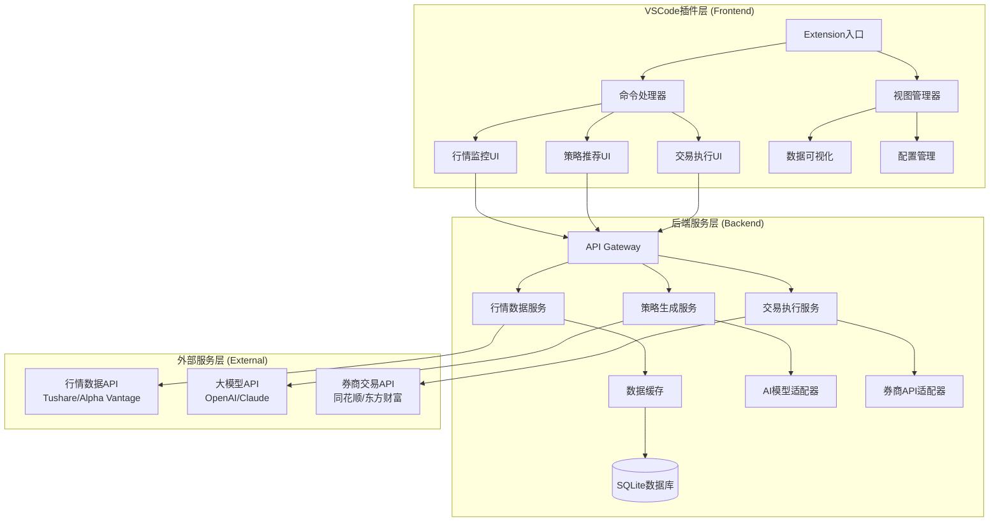
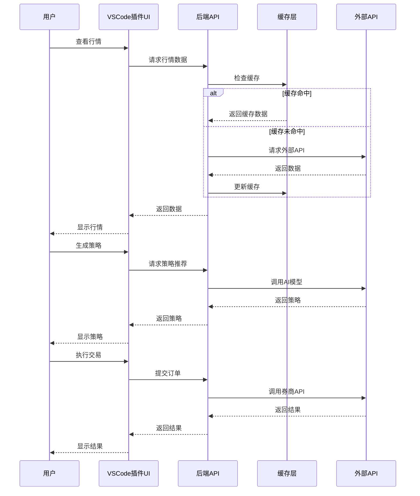
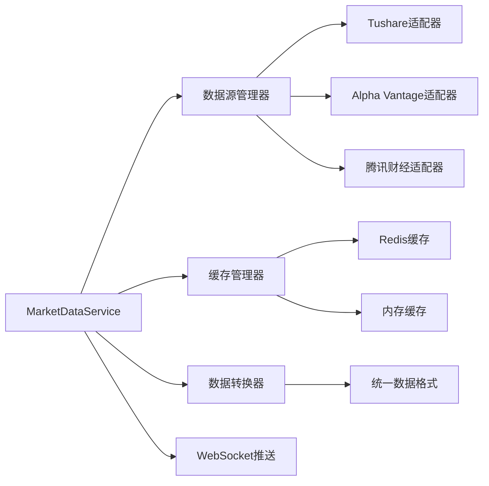
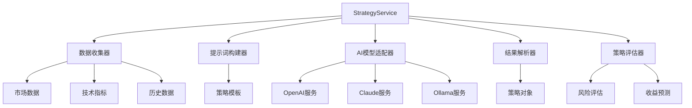
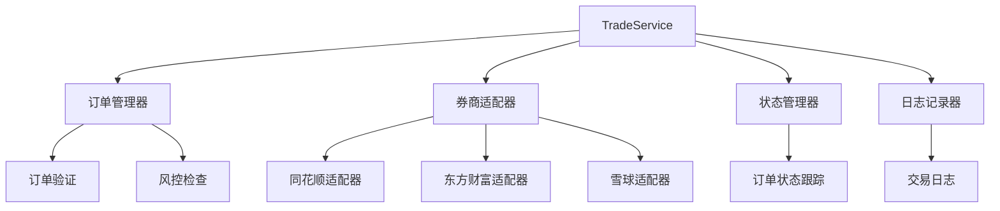
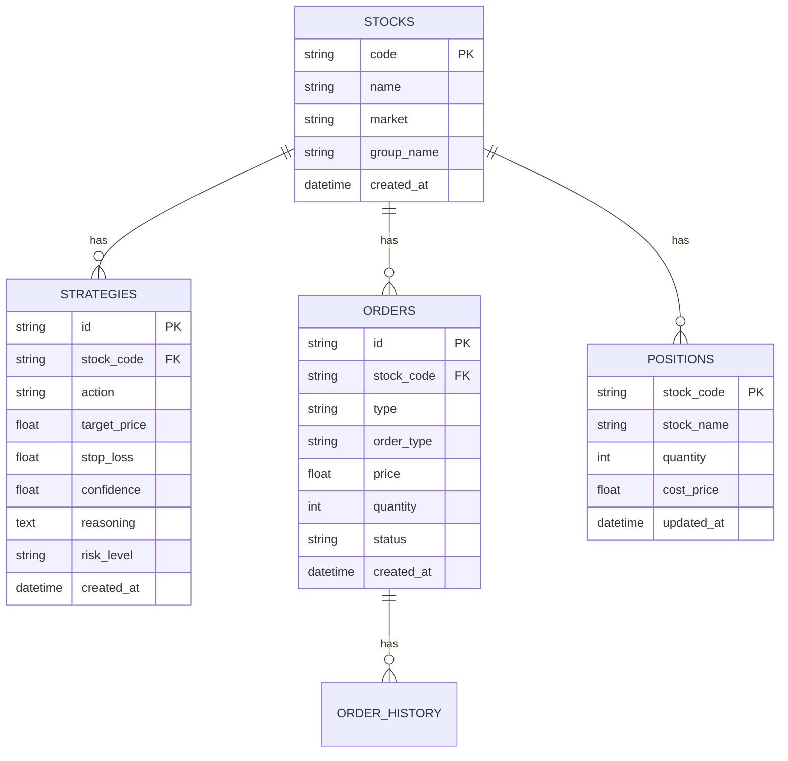

# 架构设计图（详细版）

## 1. 系统整体架构图

### 1.1 三层架构图



### 1.2 数据流架构图



## 2. 模块详细设计

### 2.1 VSCode插件模块架构

```
┌─────────────────────────────────────────────────────────┐
│                  VSCode Extension                        │
├─────────────────────────────────────────────────────────┤
│                                                          │
│  ┌──────────────────────────────────────────────────┐  │
│  │            Extension.ts (入口文件)                │  │
│  │  • activate() - 插件激活                          │  │
│  │  • deactivate() - 插件注销                        │  │
│  │  • 注册命令和视图                                  │  │
│  └──────────────────────────────────────────────────┘  │
│                          │                               │
│        ┌─────────────────┼─────────────────┐            │
│        │                 │                 │            │
│        ▼                 ▼                 ▼            │
│  ┌──────────┐    ┌──────────┐    ┌──────────┐         │
│  │ Commands │    │  Views   │    │ Services │         │
│  │          │    │          │    │          │         │
│  │ • Market │    │ • Market │    │ • API    │         │
│  │ • Strategy│   │ • Strategy│   │ • WebSocket│        │
│  │ • Trade  │    │ • Trade  │    │ • Storage│         │
│  └──────────┘    └──────────┘    └──────────┘         │
│                                                          │
└─────────────────────────────────────────────────────────┘
```

### 2.2 后端服务模块架构

```
┌─────────────────────────────────────────────────────────┐
│                  Backend Service                         │
├─────────────────────────────────────────────────────────┤
│                                                          │
│  ┌──────────────────────────────────────────────────┐  │
│  │              Express Server                       │  │
│  │  • HTTP API路由                                   │  │
│  │  • WebSocket服务                                  │  │
│  │  • 中间件（认证、日志、错误处理）                  │  │
│  └──────────────────────────────────────────────────┘  │
│                          │                               │
│        ┌─────────────────┼─────────────────┐            │
│        │                 │                 │            │
│        ▼                 ▼                 ▼            │
│  ┌──────────┐    ┌──────────┐    ┌──────────┐         │
│  │ Services │    │ Adapters │    │ Database │         │
│  │          │    │          │    │          │         │
│  │ • Market │    │ • Market │    │ • SQLite │         │
│  │ • Strategy│   │ • AI     │    │ • Redis  │         │
│  │ • Trade  │    │ • Broker │    │ • Files  │         │
│  │ • Backtest│   │          │    │          │         │
│  └──────────┘    └──────────┘    └──────────┘         │
│                                                          │
└─────────────────────────────────────────────────────────┘
```

## 3. 核心服务详细设计

### 3.1 行情数据服务架构



### 3.2 策略生成服务架构



### 3.3 交易执行服务架构



## 4. 数据库ER图



## 5. API接口设计

### 5.1 RESTful API结构

```
/api/v1/
├── market/
│   ├── GET /realtime/:codes      # 获取实时行情
│   ├── GET /history/:code        # 获取历史数据
│   ├── GET /kline/:code          # 获取K线数据
│   └── POST /subscribe           # 订阅实时数据
│
├── strategy/
│   ├── POST /generate            # 生成策略
│   ├── GET /:id                  # 获取策略详情
│   ├── GET /history              # 获取历史策略
│   └── POST /evaluate            # 评估策略
│
├── trade/
│   ├── POST /order               # 提交订单
│   ├── DELETE /order/:id         # 撤销订单
│   ├── GET /orders               # 查询订单
│   ├── GET /positions            # 查询持仓
│   └── GET /account              # 查询账户
│
└── backtest/
    ├── POST /run                 # 运行回测
    ├── GET /:id                  # 获取回测结果
    └── GET /report/:id           # 获取回测报告
```

### 5.2 WebSocket事件

```typescript
// 客户端 → 服务端
{
  "type": "subscribe",
  "data": { "codes": ["000001", "600519"] }
}

{
  "type": "unsubscribe",
  "data": { "codes": ["000001"] }
}

// 服务端 → 客户端
{
  "type": "market_data",
  "data": {
    "code": "000001",
    "price": 12.50,
    "change": 0.30,
    "timestamp": "2024-01-01T10:00:00Z"
  }
}

{
  "type": "order_update",
  "data": {
    "orderId": "12345",
    "status": "FILLED",
    "filledPrice": 12.50
  }
}
```

## 6. 部署架构图

### 6.1 开发环境

```
┌─────────────────┐
│  开发者机器      │
│                 │
│  ┌───────────┐  │
│  │ VSCode    │  │
│  │ Extension │  │
│  └─────┬─────┘  │
│        │        │
│  ┌─────▼─────┐  │
│  │ Backend   │  │
│  │ Service   │  │
│  │ localhost │  │
│  └─────┬─────┘  │
└────────┼────────┘
         │
         ▼
┌─────────────────┐
│   外部API        │
│  • 行情数据      │
│  • AI模型        │
│  • 券商API       │
└─────────────────┘
```

### 6.2 生产环境（可选云部署）

```
┌─────────────────┐
│   用户机器       │
│  ┌───────────┐  │
│  │ VSCode    │  │
│  │ Extension │  │
│  └─────┬─────┘  │
└────────┼────────┘
         │ HTTPS/WSS
         ▼
┌─────────────────┐
│   云服务器       │
│  ┌───────────┐  │
│  │ Backend   │  │
│  │ Service   │  │
│  └─────┬─────┘  │
│  ┌─────▼─────┐  │
│  │ Database  │  │
│  │ (SQLite)  │  │
│  └───────────┘  │
└────────┬────────┘
         │
         ▼
┌─────────────────┐
│   外部API        │
└─────────────────┘
```

## 7. 安全架构图

```
┌─────────────────────────────────────────┐
│           安全层架构                     │
├─────────────────────────────────────────┤
│                                         │
│  ┌──────────────────────────────────┐  │
│  │  传输层安全                       │  │
│  │  • HTTPS (TLS 1.3)               │  │
│  │  • WSS (WebSocket Secure)        │  │
│  └──────────────────────────────────┘  │
│                                         │
│  ┌──────────────────────────────────┐  │
│  │  认证授权层                       │  │
│  │  • JWT Token                      │  │
│  │  • API Key验证                    │  │
│  │  • 交易密码验证                   │  │
│  └──────────────────────────────────┘  │
│                                         │
│  ┌──────────────────────────────────┐  │
│  │  数据加密层                       │  │
│  │  • AES-256加密存储               │  │
│  │  • VSCode SecretStorage          │  │
│  │  • 敏感数据脱敏                   │  │
│  └──────────────────────────────────┘  │
│                                         │
│  ┌──────────────────────────────────┐  │
│  │  审计日志层                       │  │
│  │  • 操作日志记录                   │  │
│  │  • 交易日志记录                   │  │
│  │  • 异常日志记录                   │  │
│  └──────────────────────────────────┘  │
│                                         │
└─────────────────────────────────────────┘
```

## 8. 性能优化架构

```
┌─────────────────────────────────────────┐
│           性能优化策略                   │
├─────────────────────────────────────────┤
│                                         │
│  1. 缓存策略                            │
│     • Redis缓存 (热点数据)              │
│     • 内存缓存 (实时数据)               │
│     • SQLite缓存 (历史数据)             │
│                                         │
│  2. 请求优化                            │
│     • 批量请求合并                      │
│     • 请求去重                          │
│     • 限流控制                          │
│                                         │
│  3. 数据更新策略                        │
│     • WebSocket推送 (实时数据)          │
│     • 定时拉取 (历史数据)               │
│     • 增量更新 (只更新变化)             │
│                                         │
│  4. 异步处理                            │
│     • 策略生成异步化                    │
│     • 回测任务队列化                    │
│     • 日志写入异步化                    │
│                                         │
└─────────────────────────────────────────┘
```

---

**文档版本**：v1.0  
**最后更新**：2025年  
**维护者**：ZhengWG

